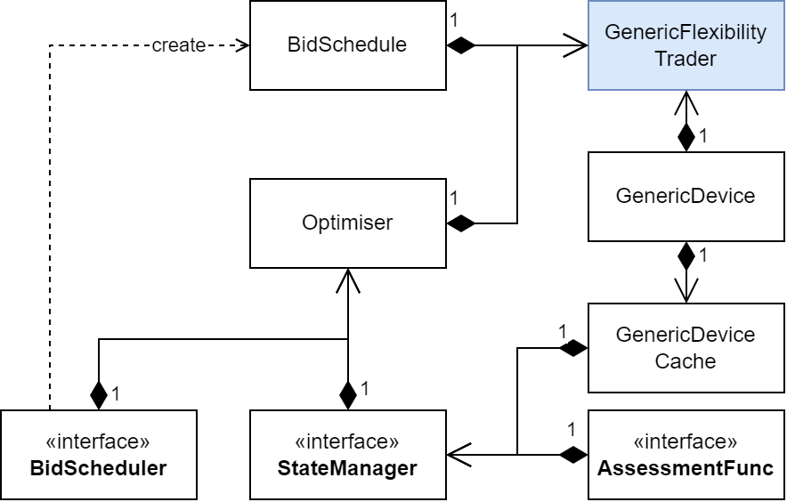

# 42 words

`GenericFlexibilityTrader` is a [Trader](./Trader.md) that operates a [GenericDevice](../Modules/GenericDevice.md) of flexibility.
It can use different dispatch optimisation strategies, state managers, and operation assessments functions.
Optimisation is based on dynamic programming and executed by an [Optimiser](../Modules/Optimiser.md).
The Optimiser finds the best dispatch while the resulting [BidSchedule](../Modules/BidSchedule.md) is used to trade at a connected [DayAheadMarket](./DayAheadMarket.md).

# Details

The operational state of a controlled flexibility device is discretised and represented by a [StateManager](../Modules/StateManager.md).
A specified [AssessmentFunction](../Modules/AssessmentFunction.md) declares an optimisation target and is used to assessment dispatch path options.
The `Optimiser` obtains the best dispatch path.
It also utilises a [BidScheduler](../Modules/BidScheduler.md) to create a corresponding `BidSchedule`.

Class structure of the dynamic programming implementation used by `GenericFlexibilityTrader`.

`GenericFlexibilityTrader` is a [ForecastClient](../Abilities/DamForecastClient.md) and can thus request forecasts from [MarketForecasters](./MarketForecaster.md).

# Dependencies

* [Optimiser](../Modules/Optimiser.md)
* [AssessmentFunction](../Modules/AssessmentFunction.md)
* [StateManager](../Modules/StateManager.md)
* [BidScheduler](../Modules/BidScheduler.md)
* [BidSchedule](../Modules/BidSchedule.md)

# Input from file

`GenericFlexibilityTrader` joins individual input groups of its submodules:

* `Device`: see [GenericDevice](../Modules/GenericDevice.md#input-from-file)
* `Assessment`: see [AssessmentFunction](../Modules/AssessmentFunctionBuilder.md#input-from-file)
* `StateDiscretisation`: see [StateManager](../Modules/StateManagerBuilder.md#input-from-file)
* `Bidding`: see [BidScheduler](../Modules/BidSchedulerBuilder.md#input-from-file)

# Simulation outputs

* `ReceivedMoneyInEUR`: Total received money in EUR
* `OfferedChargePriceInEURperMWH`: Offered price for buying electricity in EUR/MWh
* `OfferedDischargePriceInEURperMWH`: Offered price for selling electricity in EUR/MWh
* `AwardedChargeEnergyInMWH`: Amount of actually purchased energy in MWh
* `AwardedDischargeEnergyInMWH`: Amount of actually sold energy in MWh
* `StoredEnergyInMWH`: Energy stored in MWh at in the `GenericDevice` at the end of this time step
* `VariableCostsInEUR`: Sum of variable costs in EUR that occurred in this time step

# Contracts

`GenericFlexibilityTrader` has Contracts with:

* [DayAheadMarket](./DayAheadMarket.md) receives `Bids` and returns `Awards`; sends `GateClosureInfo`
* [MarketForecaster](./MarketForecaster.md) receives `MeritOrderForecastRequest` or `PriceForecastRequest` and sends `MeritOrderForecast` or `PriceForecast`

# Available Products

See [Trader](./Trader.md) and [ForecastClient](../Abilities/DamForecastClient.md).

# Submodules

See [Dependencies](#dependencies)

# Messages

* [ClearingTimes](../Comms/ClearingTimes.md) received from [DayAheadMarket](./DayAheadMarket.md) as `GateClosureInfo`
* [PointInTime](../Comms/PointInTime.md) sent to [MarketForecasters](./MarketForecaster.md) as `PriceForecastRequest`
* [Sensitivity](../Comms/Sensitivity.md) received from [SensitivityForecaster](./SensitivityForecaster.md) as `SensitivityForecast`
* [BidsAtTime](../Comms/BidsAtTime.md) sent to [DayAheadMarket](./DayAheadMarket.md) as `Bids`
* [AwardData](../Comms/AwardData.md) received from [DayAheadMarket](./DayAheadMarket.md) as `Awards`

# See also

* [Trader](./Trader.md)
* [DayAheadMarket](./DayAheadMarket.md)
* [ForecastClient](../Abilities/DamForecastClient.md)
* [SensitivityForecaster](./SensitivityForecaster.md)
* [GenericDevice](../Modules/GenericDevice.md)
* [Optimiser](../Modules/Optimiser.md)
* [AssessmentFunction](../Modules/AssessmentFunction.md)
* [StateManager](../Modules/StateManager.md)
* [BidScheduler](../Modules/BidScheduler.md)
* [BidSchedule](../Modules/BidSchedule.md)