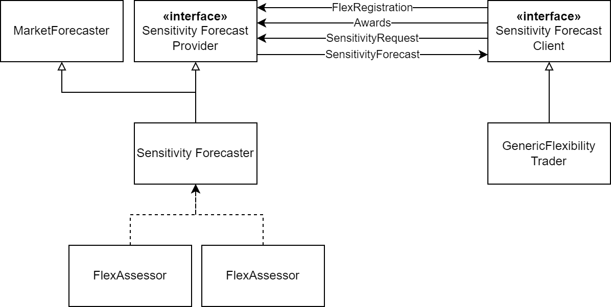

# 42 words

`SensitivityForecaster` is a subtype of [MarketForecaster](./MarketForecaster.md) and an implementation of [SensitivityForecastProvider](../Abilities/SensitivityForecastProvider.md).
It provides forecasts of the sensitivity of the merit order with respect to supply and demand changes, onto, e.g., marginal cost totals, or purchase costs.
`SensitivityForecaster` can provide estimates on joint market impact of flexibility options.

See also [MarketForecaster](./MarketForecaster.md)

# Details

The interaction of SensitivityForecastClients (SFC), e.g. GenericFlexibilityTraders, and a SensitivityForecastProvider (SFP) is shown in the diagram below:

SFC register at the SFP of their market zone.
This registration tells the SFP what kind of sensitivities to provide to the SFC.
It also helps to prepare an initial estimate of dispatch multipliers.
SFC regularly send their net awards to the SFP, which the SFP will use to update the combined impact assessment of the SFCs onto the forecasted merit order.
SFC send requests for a sensitivity, which the SFP will respond to with a according forecast.
This forecast includes an estimate of the SFC-specific dispatch multiplier.

## Assumptions

Flexibility agents **must register** at the `SensitivityForecaster` and **should send** their actual market awards.
Based on the previous market results, the cross-impact of flexibility options on the merit order is estimated by a [FlexibilityAssessor](../Modules/FlexibilityAssessor.md).
`SensitivityForecaster` can provide different types of [Sensitivities](../Comms/Sensitivity.md) as requested by the [Clients](../Abilities/SensitivityForecastClient.md) during registration.
For each type of sensitivity, a different type of [MarketClearingAssessment](../Modules/MarketClearingAssessment.md) is used.

# Dependencies

See [MarketForecaster](./MarketForecaster.md)

# Input from file

* `MultiplierEstimation`: optional group to tweak the estimation of dispatch multipliers
    * `IgnoreAwardFactor`: optional parameter, awards with less energy than the client's maximum energy divided by this factor are ignored (default: 1000).
    * `InitialEstimateWeight`: optional parameter, weight of the initial dispatch multiplier estimate; higher values cause a stronger smoothing of the dispatch multiplier at the beginning of the simulation (default: 24).
    * `DecayInterval`: optional parameter, number of estimation rounds after which the weight of a factor has decayed to $`e^{-1}`$ whereby $`e`$ denotes Euler's number (default: -1 (no decay)); see also [FlexibilityAssessor](../Modules/FlexibilityAssessor.md)

First experiments show that a small `InitialEstimateWeight` of 5-10, combined with a large `DecayInterval` of 500-2,000, and an `IgnoreAwardFactor` of 1,000 lead to good results for large scale energy systems with several different and competing flexibility options.

See also [MarketForecaster](./MarketForecaster.md)

# Input from environment

* `ForecastRegistration` messages from flexibility option clients
* `NetAward` messages from flexibility option clients

See also [MarketForecaster](./MarketForecaster.md)

# Simulation outputs

See [MarketForecaster](./MarketForecaster.md)

# Contracts

* FlexibilityOptions: receive Registration
* FlexibilityOptions: receive NetAward
* FlexibilityOptions: send SensitivityForecast

See also [MarketForecaster](./MarketForecaster.md)

# Available Products

See also [MarketForecaster](./MarketForecaster.md) and [SensitivityForecastProvider](../Abilities/SensitivityForecastProvider.md)

# Submodules

* [FlexibilityAssessor](../Modules/FlexibilityAssessor.md)
* [MarketClearingAssessment](../Modules/MarketClearingAssessment.md)

See also [MarketForecaster](./MarketForecaster.md)

# Messages

* [Sensitivity](../Comms/Sensitivity.md) sent to forecast clients

See also [MarketForecaster](./MarketForecaster.md)

# See also

* [MarketForecaster](./MarketForecaster.md)
* [SensitivityForecastProvider](../Abilities/SensitivityForecastProvider.md)
* [SensitivityForecastClient](../Abilities/SensitivityForecastClient.md)
* [FlexibilityAssessor](../Modules/FlexibilityAssessor.md)
* [Sensitivity](../Comms/Sensitivity.md)
* [MarketClearingAssessment](../Modules/MarketClearingAssessment.md)