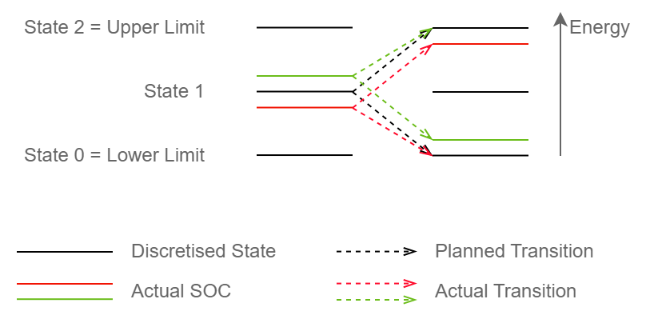

# In short

`EnergyStateManager` covers states of a [GenericDevice](./GenericDevice.md) along one dimension, representing its internal energy content or state of charge (SOC).

# Details

## Assumptions

Properties of the connected `GenericDevice` are assumed to be constant during the time steps.
Thus, the time discretisation of the TimeSeries properties of a `GenericDevice` should match (or be an integer multiple of) the time resolution of the dispatch optimisation.

To consider the SOC value at the end of the foresight horizon, `EnergyStateManager` can be parametrised with [WaterValues](./WaterValues.md).
If no `WaterValues` are provided, the value of any SOC level will be assumed to be zero.

## Operations

### TimeSeries analysis

When `EnergyStateManager`'s `initialise()` method is called, it will analyse the properties of the connected `GenericDevice` and, based on the requested energy resolution, determine how many discretisation steps are required along the time and energy dimensions.
It will detect if the `GenericDevice` has self discharge.

### State calculations

States in `EnergyStateManager` are one-dimensional compact.
This enables an efficient state representation, a full state list is not required.  
Hence,

* `useStateList()` will return `false`
* `getInitialStates()` and `getFinalStates()` will return only the IDs of the first and last state to be considered, not the full list, giving [Optimiser](./Optimiser.md) a higher speed.

### Caching

If self-discharge is not modelled, `EnergyStateManager` will operate faster and cache all transition values for a given time step during `prepareFor()`.
In any case, `EnergyStateManager` pre-caches the properties of its `GenericDevice` using a [GenericDeviceCache](./GenericDeviceCache.md) at any given time step.
**Warning**: If the `GenericDevice`'s lower or upper energy content limit is not constant, the algorithm will not consider changes in the number of states at the end of its planning interval.
This can lead to imperfect planning results and the `GenericDevice` might temporarily operate outside of its (changed) energy limits.
`EnergyStateManager` will ensure that no energy is lost or gained due to this behaviour and will correct its state along with its normal dispatch.
An according warning will be raised in this case.

See also [StateManager](./StateManager.md).

### Dispatch scheduling

When creating a dispatch schedule, `EnergyStateManager` considers the actual SOC of the associated `GenericDevice`.
However, the actual SOC might not exactly match a discretised energy state used during the optimisation.
Therefore, `EnergyStateManager` will base its schedule using the discretised energy state closest to the actual SOC.
It will perform "parallel shifts" and use the same transitions as originally planned.
However, if the transition would exceed the energy limits of the `GenericDevice` the transition will be adjusted to respect these limits.

Illustration of parallel shift transitions (green, red) of the device schedule if the device's SOC does not exactly match a discrete state during planning (black).

# Input from file

See [StateManagerBuilder](./StateManagerBuilder.md)

# See also

* [StateManager](./StateManager.md)
* [GenericDevice](./GenericDevice.md)
* [GenericDeviceCache](./GenericDeviceCache.md)
* [Optimiser](./Optimiser.md)
* [WaterValues](./WaterValues.md)