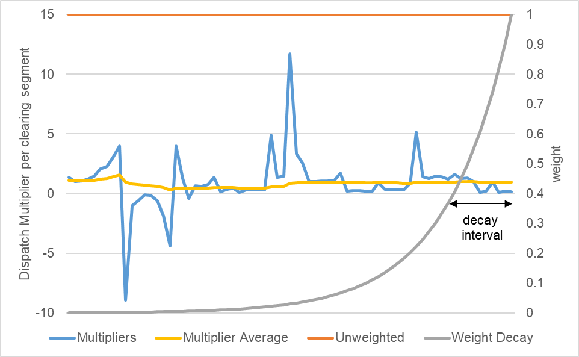

# In short

`FlexibilityAssessor` is a module of the [SensitivityForecaster](../Agents/SensitivityForecaster).
It assesses the dispatch of competing flexibility options over the course of a simulation and investigates how synchronised their dispatch is.
Based on this individual "dispatch multipliers" are calculated that help the flexibility options to estimate their joint impact on the electricity prices.

# Details

Dispatch multipliers are client specific.
They represent the "average alignment factor" of a client's own dispatch with the total awarded dispatch of all flexibility options.
For instance, a factor of 2.5 means that, on average, the total dispatch of flexibility options equals the dispatch of the client times 2.5.
Negative factors are possible if, e.g., the client operates "anti-cyclic" compared to the majority of the flexibility potential.

## Dispatch Multiplier Calculation

Based on the net awards $a_{c,t}$ of each client $c$ at clearing event times $t$ the net energy sum $S_t$ is calculated.
Assume net awards are known for three clients A, B, and C for three clearing event times t=1, 2, and 3.
Then the net energy sum at every time equals the sum of all reported net awards like so:

| client awards  | t=1 | t=2 | t=3 |
|----------------|-----|-----|-----|
| A              | 2   | 5   | -1  |
| B              | 0   | 3   | -2  |
| C              | -1  | 2   | -3  |
| net energy sum | 1   | 10  | -6  |

Then, for every client and clearing event a dispatch multiplier $m_t$ is calculated like so $m_t = S_t / a_t$, provided the absolute value of the client's net award exceeds a certain minimal value.

| client multipliers | t=1 | t=2  | t=3 |
|--------------------|-----|------|-----|
| A                  | 2   | 2    | 6   |
| B                  | n/a | 3.33 | 3   |
| C                  | -1  | 5    | 2   |

Finally, a (possibly weighted) average dispatch multiplier is calculated for each client.
The weighting function (if applied) discounts "older" multipliers exponentially.
The decay rate $r$ of older multipliers is derived from the decay interval $I$ (see below) using $r=1/I$.
The average multiplier $M$ is then calculated like so: $M = \frac{\sum_{t=T}^0 m_t * exp(-(T-t)*r)}{\sum_{t=T}^0 exp(-(T-t)*r)}$, where 

* $T$ is the current clearing time element since starting the simulation, 
* $t=0$ refers to the first clearing time element in the simulation.

## Assumptions

Flexibility option Agents are referred to as "clients".
Clients need to register in order to derive dispatch multipliers for them.
Net market awards of all flexibility options should be announced to the `FlexibilityAssessor` calculate dispatch multipliers correctly.

## Operations

All relevant flexibility options need to register using `registerClient()`.
After registration `getMultiplier()` can be called to obtain client-specific initial estimates of dispatch multipliers based on the installed power of the clients.
Actual market awards of clients are stored using the `saveAward()` method.
Once all awards of the clients at one (or multiple) timestamps are saved, call `processInput()` to update the multiplier estimates based on the actual awards. Put simply, those dispatch multipliers tell with what factor the own awards needs to be multiplied to end up with a good proxy for the total dispatch of flexibility options.
Very small awards below the `cutOffFactor` will be ignored.
If `getMultiplier()` is called again, the initial estimated and the estimates based on the net awards will be combined into new client-specific dispatch multipliers.
The outcome of this combination, which effectively forms a weighted average, depends on the `initialEstimateWeight`  and the `decayInterval`. A higher `initialEstimateWeight` puts a higher weight on the initial estimate. A higher value of the `decayInterval` means that past values are relevant for a longer time before.

## Configuration

* `cutOffFactor`: ignore awards that have lower energy than this factor times the client's maximum power
* `initialEstimateWeight`:  weight of the initial estimate, must be at least 1
* `decayInterval`: determines how slow dispatch multipliers values from previous times are discounted;
    * -1: no discounting, all previous values are considered equally
    * 0: immediate discounting, only the latest value is considered (discouraged)
    * n: discounted by factor exp(-1) after n steps

# Input

* `maxEnergyDeltaInMWH` per client and time interval, i.e. is proportional to the maximum power of the client, used for initial multiplier estimate
* `award` per client and clearing time, regularly updated to derive dispatch multipliers from

# See also

* [SensitivityForecaster](../Agents/SensitivityForecaster)