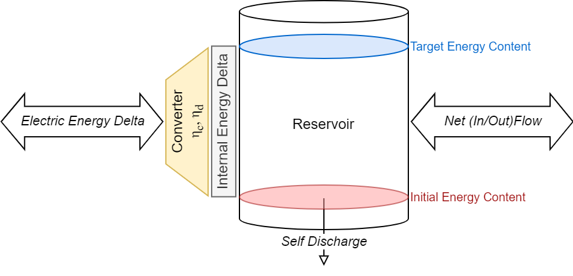
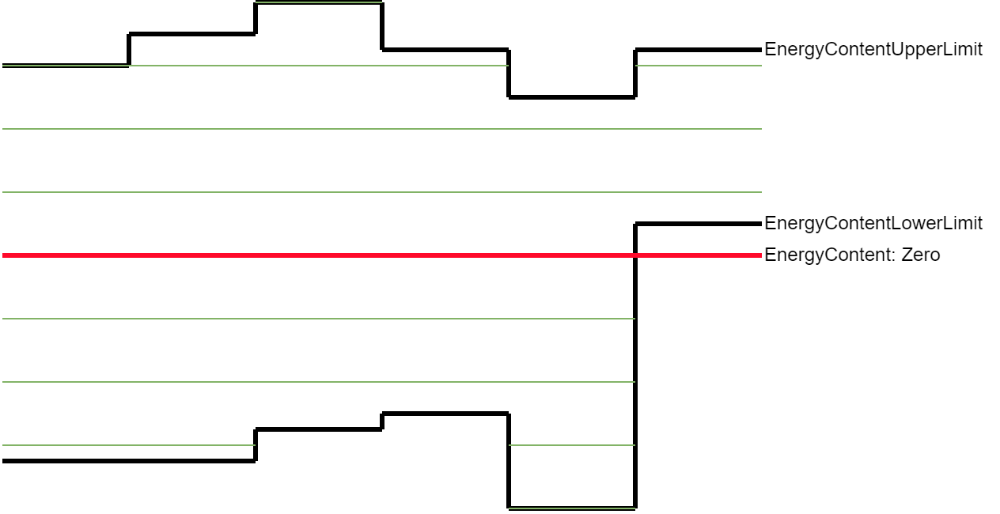

# In Short

A `GenericDevice` represents any kind of electrical flexibility, e.g., pumped-hydro storages with inflow, reservoir storages, heat pumps, electric vehicle fleets or load shifting portfolios.

# Details

A `GenericDevice` is a physical representation of a flexibility source.
Specifically, it keeps track of the current energy level.
This level can be changed by charging, discharging, inflows, and self discharge.
A `GenericDevice` can handle arbitrary time resolutions and time-variant technical parameters, see section [Input from file](#Input-from-file)
It is connected to a trader who markets the flexibility by applying an algorithm to schedule its operation.

Besides "getter" methods for (current/maximum/minimum) energy content, (charging/discharging) efficiencies and the self discharge rate, `GenericDevice` provides the following methods:

* `transition`: Performs an actual transition from the current energy content at given time using a given external energy delta. It enforces energy and power limits. Returns actual external energy delta considering applied limits, i.e. positive values represent charging.
* `internalToExternalEnergy`: Converts a given internal energy delta of a `GenericDevice` to an external energy delta by applying charging efficiency $\eta_\mathrm{c}$ or discharging efficiency $\eta_\mathrm{d}$.

For performance improvement, a cached version of a `GenericDevice` is used to simulate transitions within the dynamic programming scheduling algorithm, see [GenericDeviceCache](./GenericDeviceCache)

## Assumptions

* Within the duration of a transition, all parameters (net flow, self-discharge rate, energy & power limits, (dis-)charging efficiencies) are assumed to be constant.
* For internal accounting, a `GenericDevice` only uses internal storage power and energy levels. For interaction with the outside, efficiency losses are applied.
* It is assumed that self-discharge only applies to the initial energy level. The change of energy levels during a transition is neglected. Thus, minor deviations to detailed physical storage device simulations may occur.

_Energy flows impacting the energy content of the reservoir_

## Dynamic Programming

For the scheduling with dynamic programming, energy levels are divided into discrete energy states using a _fixed_ energy resolution.
As lower and upper energy limits may vary over time, this means that certain energy states cannot be reached.
The lowest and highest energy state do not necessarily equal the current minimum and maximum energy content.
A higher energy resolution leads to smaller deviations.

_Feasible dynamic programming states considering time-variant upper and lower energy limits_

# Input from file

`GenericDevice` defines a set of input parameters, which can be used to define the required inputs for Agents that control such a device.
These required input parameters are `TimeSeries`:

* `GrossChargingPowerInMW`: maximum charging power of the associated flexibility device in MW at grid
* `NetDischargingPowerInMW`: maximum discharging power of the associated flexibility device in MW at grid
* `ChargingEfficiency`: efficiency of the charging process (value from 0 to 1); 1 means 100% efficiency, i.e. no losses due to charging; defaults to 1 (specified in schema).
* `DischargingEfficieny`: efficiency of the discharging process (value from 0 to 1); 1 means 100% efficiency, i.e. no losses due to discharging; defaults to 1 (specified in schema).
* `EnergyContentUpperLimitInMWH`: maximum electrical energy content of the associated flexibility device in MWh
* `EnergyContentLowerLimitInMWH`: minimum electrical energy content of the associated flexibility device in MWh; defaults to 0 (specified in schema).
* `SelfDischargeRatePerHour`: rate at which the associated electricity storage looses energy due to self discharge per hour relative to _initial_ level of charged energy (value from 0 to 1); 0 means no internal self-discharge; defaults to 0 (specified in schema).
* `NetInflowPowerInMW`: _net_ inflow into the associated flexibility device in MW; positive values are inflows, negative values are outflows; defaults to 0 (specified in schema).

In addition, a scalar double parameter exists:

* `InitialEnergyContentInMWH`: electrical energy stored in the associated flexibility device in MWh at the beginning of the simulation; defaults to 0 (specified in schema).

# See also

* [GenericFlexibilityTrader](../Agents/GenericFlexibilityTrader)