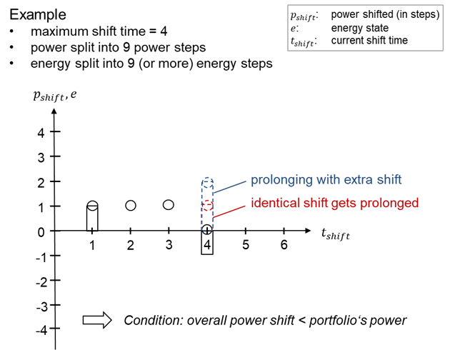
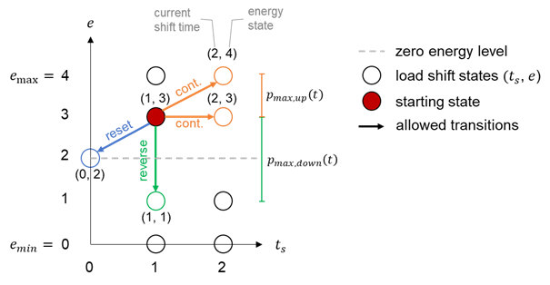

# In Short

Child classes of the [LoadShiftingStrategist](./LoadShiftingStrategist) that are based on dynamic programming use the LoadShiftStateManager to ensure meeting the time-, energy- and power-related constraints for load shifting.

# Details

The LoadShiftStateManager ensures to take only feasible load shift states.
A load shift state in turn consists of the current shift time, i.e. the time that has already been shifted for so far, as well as a load shift energy state.
The latter is defined as an integer value between 0 and the number of energy states - 1.

There are several ways to ensure that constraints are not violated:

## Energy constraints

The load shift state manager spans a symmetrical grid of feasible load shift states around the zero energy state that is constrained by the maximum and minimum energy state.
Thus, by this definition it is already ensured that energy limits may not be violated.
The zero energy state is the one that corresponds to a real-world load shift energy level of 0, i.e. a load shift portfolio for which the shifts are levelled out at this particular simulation time step.

## Power constraints

The transition from one energy-state to another is limited in such a way that the additional power shifted in upwards direction is smaller or equal to the allowed upshift at this particular simulation time step.
The allowed upshift power in turn is retrieved by multiplying the PowerInMW value of a [LoadShiftingPortfolio](./LoadShiftingPortfolio) with the PowerUpAvailability time series value for this time step. Analogously, power downshifts are limited to be smaller or equal to the maximum allowed downshift for this time step.

## Shift time constraints

The following rules and calculation procedures are applied to the shift time:

* If the energy state is the zero energy state, the shift time is set to 0.
* The shift time is increased by one for each time step in which the load shifting portfolio is unbalanced.
* If there is a change of the sign for the energy balance (by changing from load advancement to delay or vice versa), the shift time is reset to 1.
* If the shift time is about to reach the maximum allowed shift time within the next transition, there is a need to balance the portfolio. Hence, the energy state is reset to the zero energy state and the shift time is set to 0 accordingly, unless a prolonged shift is found to be favourable.

## Option for prolonging shifts

It is assumed, that the portfolio is built from multiple independent units capable of load shifting, e.g., several households or companies.  
Thus, if the maximum shifting time has been reached, a load shift can be transferred from one part of the portfolio (currently experiencing a shifted load), to another part of the portfolio (currently not experiencing load shifting).
This we call prolonging a shift beyond the maximum shifting time. 
However, each unit of the load shifting portfolio is expected to only perform one type of load shift per time step (up or down).
Thus, if X% of the portfolio are required to shift, e.g. down, to end their current load shifting, only 100 - X% of the portfolio are available for shifting up again at the same time.   
This puts stricter constrains on the portfolio's available net shifting power.
The implemented prolonging algorithm correctly considers different maximum up- and downshift power constraints. 

Prolonged shifts effectively add twice the variable costs of the prolonged shift power (for compensating and re-establishing the shift within the portfolio).
The [LoadShiftingStrategist](./LoadShiftingStrategist) considers these extra costs.
The originally shifted power can be reduced, increased or kept at the same level, provided enough down- and upshifting capacities exist.

The following figure shows two examples for possible prolonging.

_Possibility to prolong shifts_

## Example for feasible transitions

The following figure shows an example for selecting feasible next states based on the assumption of a starting state of (current shift time = 1, energy state = 3) and a power limit of ±2. Several options exist:

* Balance out the previous load shift and return to $e_0$. This also resets the shift time to zero resulting in the blue transition to state (0,2).
* Continue the load shift in the current direction (orange arrows). This includes either remaining at the same energy level or further shifting in the same (upward) direction. In both cases the shift time is increased and the two allowed follow-up states are either (2,3) or (2,4).
* Reverse the load shift (green arrow) with maximum downward power. Due to the reversed sign of the energy level, i.e. the respective energy state < zero energy state, the shift time is set to 1.
  Other discretised load shift states cannot be reached in this example due to the energy and power restrictions and the rules on shift times. Note that the load shift states (shift time > 0, energy state = 2) are not available, since the shift time is defined to be 0 at the zero energy level.

_Feasible load shift transitions_

# Input from file

None