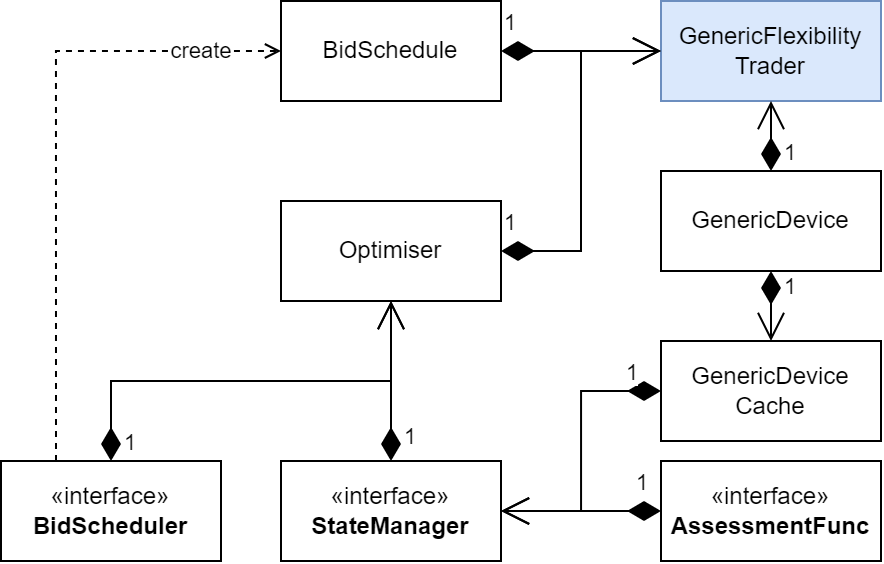

# In Short

`Optimiser` in package `dynamicProgramming` finds the best dispatch strategy for a [GenericDevice](./GenericDevice.md) using dynamic programming.
It maximises or minimises the value of a given [AssessmentFunction](./AssessmentFunction.md).

# Details

The operational states are controlled by a [StateManager](./StateManager.md), which also assesses the value of transitions between states.
After the optimisation is run, the best operation path can be obtained from the `StateManager`.
This best dispatch schedule is then fed to [BidScheduler](./BidScheduler.md) to obtain an associated [BidSchedule](./BidSchedule.md).

Diagram of classes associated with the dynamic programming package.

## Operations

The implementation of `Optimiser` depends on the `StateManager`'s representation of states.
If those are compact, it suffices to return only the first and last state index to consider.
Otherwise, a full list of all state IDs that are to be considered is required.
This impacts the loop mechanics in the `Optimiser`.

## Input

`Optimiser` requires a `StateManager`, `BidScheduler`, and a `Target`.
The latter tells `Optimiser` whether to maximise or minimise the assessment value.

# See also

* [GenericDevice](./GenericDevice.md)
* [StateManager](./StateManager.md)
