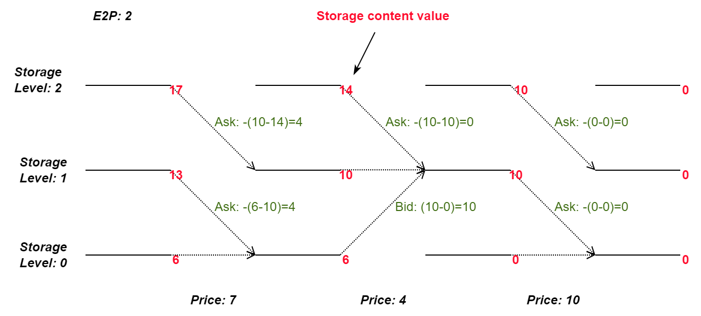

# In short

`StorageContentValue` exploits knowledge regarding the (dynamic) value of storage content created during the dynamic programming.
The basic idea is: asks or bids should match their corresponding opportunity costs.

# Details

## Assumptions

This bidding strategy assumes that the storage content values (based on the received electricity price forecasts) are accurate.
If the storage content values are based on predictions with large errors, the content values will also be erroneous, and thus this bidding strategy might not provide good results.
Especially, if large systematic error exists, e.g. consistently higher realised prices when buying, or consistently lower realised prices when selling, this bidding strategy might even lead to losses. 

## Implementation

Please see the schematic depiction of the dynamic programming for a storage device with 100% round-trip efficiency, energy-to-power level of two, discretised into three discrete states (empty, half-filled, and full) below:

Therein, the solid lines represent the three possible states for each time step and their associated storage value (red numbers).
In this example, three time steps with prices 7, 4, and 10 are considered.
Dotted lines represent the best transition to a follow-up state.

For each transition, we estimate the opportunity costs as follows:

* for bids: Assuming the transition *does not* happen, what storage content value will be lost?
* for asks: Assuming the transition *does* happen, what storage content value will be lost?

Compared to the [EnsureDispatch](./EnsureDispatch.md) bidding strategy, `StorageContentValue` has a higher risk of unfulfilled offers at the market, but also reduces the bidding risks in case forecasts have errors.

# See also

* [BidScheduler](./BidScheduler.md)
* [EnsureDispatch](./EnsureDispatch.md)