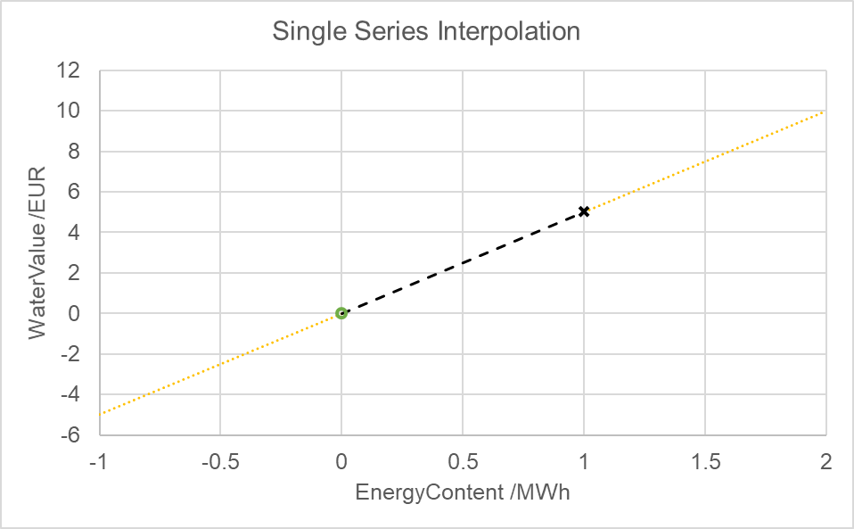
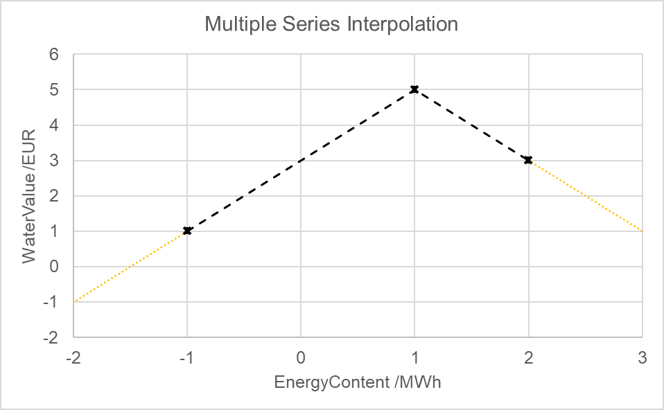

# In short

`WaterValues` is a class to estimate the value of a flexibility device's states of charge ("water value") at any time.
Water values are used to consider the long-term value of stored energy beyond the foresight horizon of an optimisation.

# Input from file

* `StoredEnergyInMWH`: mandatory float, the absolute state of charge of the flexibility device in MWh which the associated water value timeseries applies to
* `WaterValueInEUR`: mandatory timeseries, the absolute value in EUR of the associated absolute state of charge of the flexibility device over time

The parameters are part of a list group in [StateManagerBuilder](./StateManagerBuilder): Multiple pairs of `StoredEnergyInMWH` and `WaterValueInEUR` can be provided.

# Details

## Assumptions

If no input data is provided, `WaterValues` will yield Zero for any time and energy content.
Use method `hasData()` to check if data is available on an instance of `WaterValues`.

If data is provided, `WaterValues` will interpolate and extrapolate linearly when its method `getValueInEUR(time, energyContent)` is invoked.
In any case, the returned value will be an absolute value in EUR and may depend on the requested time.
Linear interpolation is also used along the time axis of the provided water value time series.

## Interpolation

The mode of water value interpolation depends on the number of data series provided (see below).

### One value series

If ony one water value series is provided, it is additionally assumed that the water value is Zero for the SOC at Zero.
Thus, the provided water value series **cannot** be associated with `StoredEnergyInMWH=0`, or interpolation will fail.
In this case, `WaterValues` will issue a warning and return Zero for all calls to `getValueInEUR(...)`.
Otherwise, the assumed (0,0) point and the provided (energy, value(time)) point form a gradient along which the value of any requested energy content is inter- or extrapolated.
Due to the (potential) time-dependence of the water value series, the gradient may change over time.

Figure 1: Water value interpolation with one provided value series

Figure 1 illustrates the interpolation assuming a single water value of 5 EUR is provided for an energy content of 1 MWh (black cross).
A value of 0 EUR at an energy content of 0 MWh is automatically assumed (green circle).
Values between 0 and 1 are interpolated (black dashed line) and values outside of this interval extrapolated (orange dotted lines).

### Multiple value series

If two or more water value series are provided, values are interpolated linearly if the requested energy content is in between the provided data points.
Otherwise, of the requested energy content is below the lowest or above the highest provided data point, the value is extrapolated linearly based on the closest two available data points.
Due to the (potential) time-dependence of the water value series, the interpolation results may change over time.

Figure 2: Water value interpolation with multiple provided value series

Figure 2 illustrates the interpolation for three given data points: (-1 MWh, 1 EUR), (1 MWh, 5 EUR), (2 MWh, 3 EUR) as indicated by the black crosses.
Values between the provided data points are interpolated (black dashed line) and other values are extrapolated linearly (orange dotted lines) from the closest two data points.

# See also

* [EnergyStateManager](./EnergyStateManager)