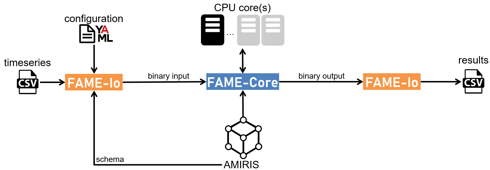

# AMIRIS With FAME-Io Setup Guide

AMIRIS is based on [FAME](https://gitlab.com/fame-framework/wiki/-/wikis/home).
This allows you to use the FAME command line tools to run AMIRIS.

## Requirements

### Already installed AMIRIS-Py?

If you already installed AMIRIS-Py you can skip this part.
FAME-Io is automatically installed with AMIRIS-Py to your Python environment.
You can safely use both methods of running AMIRIS from within the same Python environment.

### Otherwise...

... since AMIRIS is a *JAVA* application configured via *Python* scripts, you need to set up a Python environment and make sure to have Java available.
To run AMIRIS, **Python** and a **Java Development Kit** are required.
Check the required version [here](../Get-Started.md#requirements).
For a detailed guide on how to install both, see the AMIRIS-Py [Step-by-Step Guide](./StepByStep.md#requirements).
Similar to when working with AMIRIS-Py, you will need a Python-enabled shell.
Follow the instructions in the AMIRIS-Py [Step-by-Step Guide](./StepByStep.md#environment) for more details.

### Install FAME-Io

In your Python environment run

````
    pip install fameio
````

You are now ready to compile input files for AMIRIS and read its outputs.

## Run AMIRIS

### Workflow

The picture below describes the workflow between AMIRIS and FAME-Io:



AMIRIS is built with the _FAME-Core_ Java library.
Inputs, interactions and outputs of each agent in AMIRIS are described in the "schema.yaml" file.
The [YAML](https://yaml.org/) format is used throughout for configuration files.
Execution of AMIRIS requires a binary input file in [protobuf](https://protobuf.dev/overview/) format that is compiled using _[FAME-Io](https://gitlab.com/fame-framework/fame-io)_.
This step requires another configuration YAML file, usually named "scenario.yaml".
Timeseries are external files linked to the scenario.
_FAME-Io_ validates the provided configuration based on the given schema and creates the binary input file.
To start the simulation, the AMIRIS ".jar" executable is provided to Java together with the compiled binary input.
A binary output file in protobuf format is created by the AMIRIS simulation.
Finally, _FAME-Io_ translates the binary outputs to readable outputs in CSV format.

### In a Nutshell

FAME-Io comes with two shell scripts

* `makeFameRunConfig` translates configuration files to binary AMIRIS input in "protobuf" format
* `convertFameResults ` extracts AMIRIS results in "protobuf" format to human-readable .csv files

The full workflow of running AMIRIS with FAME-Io is thus:

1. Compile a binary input file from a scenario definition using FAME-Io
2. Run AMIRIS with binary input using Java
3. Extract AMIRIS results to csv files using FAME-Io

### Create Binary Input

A scenario definition is required to create a binary input for AMIRIS.
Putting together the right assumptions and data for a full energy market scenario can take quite some time.
Luckily, we have **example scenarios** prepared for you.

Clone the [AMIRIS-Examples](https://gitlab.com/dlr-ve/esy/amiris/examples) project or download its content into a new folder called "examples":

```
    git clone https://gitlab.com/dlr-ve/esy/amiris/examples.git
```

The examples folder contains multiple different scenario setups.
Now, compile a binary input file from the Germany2019 example scenario:

1. Open your Python-enabled shell and activate your environment (called "amirisEnv" here): `conda activate amirisEnv`
2. Change directory to the "Simple" folder: `cd examples/Simple/`
3. Execute `makeFameRunConfig -f scenario.yaml`

This will compile all agents, their data and configured behaviour into a single binary file "config.pb" in the same folder.

### Run AMIRIS in console

Let's run AMIRIS with a previously compiled binary input "config.pb".
If you haven't installed AMIRIS using AMIRIS-Py you need to download AMIRIS first, see e.g. [here](./Precompiled.md).
To run AMIRIS open a console, navigate to the folder where you installed AMIRIS binaries to, e.g. `cd ../../` if you are still in the "Simple" folder.
Then execute:

```
java -jar "amiris-core_x.y.z-jar-with-dependencies.jar" --input-file examples/Simple/config.pb
```

Its components are:

1. `java` fires up the installed java runtime environment
2. `-jar "amiris-core_x.y.z-jar-with-dependencies.jar"` tells Java to load the pre-built AMIRIS executable archive; "x.y.z" represents the version of AMIRIS (e.g. 3.3.0).
3. `--file examples/Simple/config.pb` tells the FameRunner to load the given config file and read its simulation setup. Since this setup explicitly refers to AMIRIS classes, FAME will load these classes and feed them with the input data provided in the config file.

Running AMIRIS should create the result file "output.pb" in the current folder.

### FAME-Core Command Line Options

FAME-Core offers several command line options, e.g.,

* path and name of the output file, 
* whether you want a time stamp attached with the name or not,
* what kind of output data shall be written.

Run `java -jar "amiris-core_x.y.z-jar-with-dependencies.jar --help` for a full list and description of each command line option.

### Extract Results

Let's extract the binary output file to be able to read them.
We assume you still have your Python environment with fameio loaded.
Extract the results: `convertFameResults --file output.pb --output simple` where "output.pb" is the name of your simulation output file.
This will create a folder named "simple" and many CSV files therein.
See the dedicated [Results Page](./Results.md) for an explanation of the CSV files' structure.
