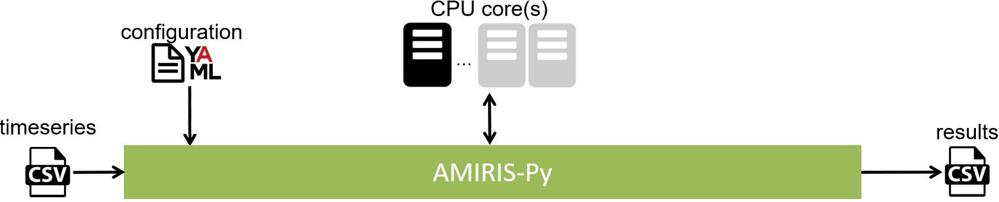

# AMIRIS Step-By-Step Guide

AMIRIS is a *JAVA* application configured via *Python* scripts.
To run AMIRIS, **Python** and a **Java Development Kit** are required, check required version [here](../Get-Started.md#requirements).

## Requirements

### Java

Check if your system has Java already installed by using the command `java --version` (or `java -version` on some systems).   
This should show your Java version if Java was found.
If you get a "command not found" error, or if your Java version is less than the one specified in the [Requirements](../Get-Started.md#requirements), please download and install a recent JDK from e.g. [here](https://adoptium.net/).

### Python

You will need a Python-enabled shell with pip.
You can test if you have Python available by using the command `python --version`.
This should show your Python version if the Python command was found.
Make sure the version of your Python is covered by the AMIRIS [Requirements](../Get-Started.md#requirements).
Note that if you use a Python environment manager you can have several Python versions on your system side by side.
If you do not have a Python environment manager installed on your system, you may use e.g. [conda](https://docs.conda.io/en/latest/miniconda.html), [mamba](https://github.com/conda-forge/miniforge#mambaforge), or [Poetry](https://python-poetry.org/).

## Environment

In case you do not have any experience with creating a Python environment, we recommend to use [anaconda](https://www.anaconda.com/).
Install anaconda, start the anaconda prompt or powershell and enter:

1. `conda create -n amirisEnv python=3.11`
2. `conda activate amirisEnv`

If you are using mamba instead of conda, simple replace "conda" in the first command with "mamba" (but not in the second).

## Install AMIRIS-Py

[AMIRIS-Py](https://gitlab.com/dlr-ve/esy/amiris/amiris-py/-/blob/main/README.md) enables you to install and execute AMIRIS with one command.
To install it, make sure you are in your AMIRIS Python environment (called "amirisEnv" above) and run

```
pip install amirispy
```

This will grant you a new shell command `amiris`.

## Download AMIRIS

1. Create a new folder on your disk called, e.g., "AMIRIS": `mkdir AMIRIS`
2. Navigate to this newly created folder: `cd AMIRIS`
3. Activate your Python-enabled shell that includes amiris-py: `conda activate amirisEnv`
4. Download the latest AMIRIS build use: `amiris download`

This downloads the latest [AMIRIS model](https://gitlab.com/dlr-ve/esy/amiris/amiris/-/jobs/artifacts/main/download?job=deploy:jdk11) and the latest version of [AMIRIS examples](https://gitlab.com/dlr-ve/esy/amiris/examples) into the current folder.
As a result, your "AMIRIS" folder should look like this:

```
AMIRIS
├─── examples
│    ├─── demo/
│    │    ├─── Simple/
│    │    └─── SimpleCoupled/
│    ├─── backtest/
│    │    ├─── Austria2019/
│    │    ├─── ...
│    │    └─── Germany2019/
│    └─── README.md
└─── amiris-core_x.y.z-with-dependencies.jar
```

You are now ready to run AMIRIS simulations.

## Update AMIRIS

Feel free to give the AMIRIS project a "star" :star: and hit the notification bell :bell: in order to get notifications on new releases.
**In the future**: If you want to update your existing model version use

* `amiris download -m model` to download the latest model, and
* `amiris download -m examples` to get the latest examples.

## Run AMIRIS


The image above shows the workflow when running simulations with AMIRIS-Py.
AMIRIS-Py will load the specified scenario configuration, read linked timeseries files, and run the simulation.
Once finished, AMIRIS-Py will automatically extract the simulation results to CSV files.

To run AMIRIS, excecute:

```
amiris run -s ./examples/demo/Simple/scenario.yaml -o simple
```

This runs AMIRIS using any Java archive (jar) file named `amiris<*>.jar` in the current folder.
If the .jar file resides in a different folder, you may link it with the `-j` command line option.
The scenario file specified after the `-s` option is simulated.
The AMIRIS outputs are stored in a folder designated after the `-o` option.

Now, open the newly created folder named "simple" and check out the [Results](./Results.md).